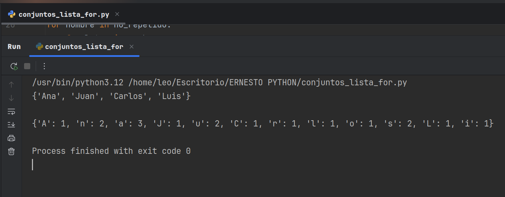

# Análisis de Nombres y Frecuencia de Letras en Python
Este proyecto demuestra un enfoque eficiente para la manipulación de colecciones en Python, utilizando conjuntos (set) para asegurar la unicidad de elementos y diccionarios (dict) para realizar conteos de frecuencia. El script procesa una lista de nombres para extraer valores únicos y, posteriormente, calcula la ocurrencia de cada carácter en estos nombres.

## Estructuras de Datos: 
Manejo avanzado de sets para la eliminación de duplicados y dictionaries para el conteo de frecuencias.

## Lógica de Programación:
Implementación de bucles anidados y condicionales para el procesamiento de texto y la acumulación de datos.

## Eficiencia de Código:
Solución concisa y clara para un problema común de procesamiento de cadenas y datos.
- 

- * **Autor: @AndresGolDev** - [**Github link:**]([https://github.com/tu-usuario](https://github.com/AndresGolDev)
